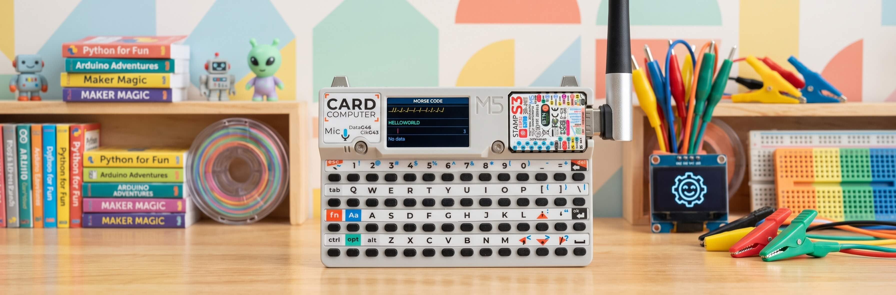

# MORSE CODE TRANSLATOR — M5Stack Cardputer

[](https://docs.micropython.org/)
[](https://aiflow.m5stack.com/)
[](https://docs.m5stack.com/en/device/Cardputer)
[](LICENSE)

<p align="center"></p>

A real-time Morse code translator for the **M5Stack Cardputer** running MicroPython / UIFlow2. It listens to spoken Morse code through the built-in microphone, decodes dots and dashes in real time, and displays the resulting text on the 240×135 OLED display.

---

## Features

- 🎙️ Real-time Morse code decoding from audio input
- 🔤 Full ITU standard Morse map — letters, numbers, and common punctuation
- 📈 Adaptive timing engine — learns and adjusts to your Morse speed automatically
- 🎚️ Live RMS volume meter with threshold indicator
- 📊 Status display showing current decode state (DOT / DASH / GAP / WORD GAP)
- 🔁 Automatic mic rescan if audio data stops flowing
- ⚡ Memory-conscious — runs entirely on-device, no WiFi or network needed

---

## Architecture

```
┌───────────────────────────────────────────────────────┐
│                      main.py                          │
│  ┌────────────┐  ┌────────────┐  ┌─────────────────┐  │
│  │  MIC CAP   │  │  DISPLAY   │  │   STATE MACHINE │  │
│  │  (M5.Mic)  │  │  (M5.Lcd)  │  │  IDLE→SOUND→GAP │  │
│  └─────┬──────┘  └─────┬──────┘  └────────┬────────┘  │
│        │               │                  │           │
│  ┌─────▼───────────────▼──────────────────▼─────────┐ │
│  │              DECODER PIPELINE                    │ │
│  │  ┌─────────────────┐    ┌─────────────────────┐  │ │
│  │  │  SIGNAL ANALYSIS│    │   MORSE PARSER      │  │ │
│  │  │ (RMS, noise,    │    │ (dots, dashes,      │  │ │
│  │  │  threshold)     │    │  letter/word gaps)  │  │ │
│  │  └─────────────────┘    └─────────────────────┘  │ │
│  └──────────────────────────────────────────────────┘ │
│                            │                          │
│                   ┌────────▼─────────┐                │
│                   │   MORSE_MAP      │                │
│                   │ (character table)│                │
│                   └────────┬─────────┘                │
└────────────────────────────┼──────────────────────────┘
                             │
                   ┌─────────▼─────────┐
                   │  Display output   │
                   │ (decoded text)    │
                   └───────────────────┘
```

### Three States

| State | Trigger | Behavior |
|-------|---------|----------|
| **IDLE** | Signal below threshold | Listens for the next Morse pulse. Learns background noise floor. |
| **SOUND** | RMS crosses ON threshold | Measures pulse duration. On signal end, classifies as DOT or DASH and updates the adaptive timing. |
| **GAP** | Signal drops below OFF threshold | Measures silence duration. Classifies as letter gap (`|`) or word gap (space). |

The **adaptive timing engine** continuously refines its estimate of the "unit" duration (the length of a single dot) using exponential smoothing. This allows the decoder to handle a wide range of Morse speeds without user configuration.

---

## Project Structure

```
M5Cardputer-Morse-Code-Translator/
├── src/
│   └── main.py          # Main application (~660 lines)
├── docs/
│   └── banner.jpg       # Project banner image
└── README.md
```

### Morse Map Coverage

The built-in `MORSE_MAP` supports:

| Category | Symbols |
|----------|---------|
| Letters | A–Z |
| Numbers | 0–9 |
| Punctuation | `. , ? ' ! - & : ; = + ( )` |
| Special | `SOS` |

---

## Hardware Requirements

- **M5Stack Cardputer v1.1** (ESP32-S3 based, 240×135 LCD, built-in microphone)
- No external peripherals required — the built-in mic and LCD are sufficient
- No WiFi or network connection needed

---

## How to Flash

### Prerequisites

1. Install [UIFlow2](https://aiflow.m5stack.com/) and connect your Cardputer via USB.
2. In UIFlow2, select **M5Stack-Cardputer** as the device and create a **blank project**.
3. Make sure the **M5** (Cardputer) firmware image includes the `Mic` module.

### Step 1 — Flash the main application

1. Switch the UIFlow2 editor to **Code mode** (Python).
2. Copy the contents of `src/main.py` and paste them into the editor.
3. Click **Flash** to write the program to the Cardputer.

### Step 2 — First run

After flashing, the Cardputer will:

1. Initialize the display and draw the static header.
2. Run the **mic search routine** — tries multiple sampling configurations to find a working mic variant.
3. Show "Searching mic..." then "Listening..." when ready.
4. Begin real-time Morse decoding.

> **Note:** If the mic search fails, the display shows "Mic fail!" with a retry option. Press **BtnA** to re-attempt the mic scan.

---

## Using the App

### Display Layout

| Row | Content | Color |
|-----|---------|-------|
| Header | "MORSE CODE" title | Light blue on dark navy |
| Morse line | Raw dot/dash sequence (e.g. `...-|.-|`) | Gold |
| Result line | Decoded text (e.g. `THE`) | Green |
| Volume bar | Real-time RMS level + threshold marker | Green / grey / red marker |
| Status line | Current state: "Listening...", "SOUND", "DOT", "DASH", "Gap", "Rescan..." | Various |

### Controls

| Button | Action |
|--------|--------|
| **BtnA** | Retry mic scan, or clear current decode buffer |
| **Speak Morse** | Use any sound source (clicks, key taps, whistle) to transmit Morse |

### How Decoding Works

1. **Audio captured** at 8 kHz in 16 ms frames (128 samples).
2. **Signal analysis** computes RMS, detects noise floor, and flags dead/stuck audio.
3. **Threshold crossing** triggers state transitions between IDLE, SOUND, and GAP.
4. **Pulse duration** is measured and classified as DOT (< 2× unit) or DASH (≥ 2× unit).
5. **Gap duration** is measured and classified as letter gap (≥ 1× unit) or word gap (≥ 1.5× unit).
6. **Letter completion** occurs when a gap is detected; the accumulated dot/dash string is looked up in `MORSE_MAP`.
7. The adaptive `unit_ms` estimate is updated after each pulse using exponential smoothing.

### Tips for Best Results

- Speak Morse **evenly** — the decoder is adaptive but consistent timing yields cleaner results.
- Use **clicks** (fingertips on a surface) or a **pen tapping** the device for clean, sharp pulses.
- Keep **background noise low** — the adaptive noise floor helps, but a quiet environment is best.
- Pause for at least **1× unit** between letters and **1.5× unit** between words.

---

## Troubleshooting

| Symptom | Possible cause |
|---------|----------------|
| "Mic fail!" on boot | The built-in mic module may need a firmware update; try **BtnA** to rescan |
| "No data" status | No audio being captured; check that nothing is blocking the mic |
| "Rescan..." appears repeatedly | Audio data is dropping; the decoder is auto-recovering the mic config |
| Misdecoded characters | Speak more evenly; increase pause between letters and words |
| All dots read as dashes | The adaptive unit estimate may be off; clear the buffer with **BtnA** and start fresh |
| Volume bar stuck at 0 | Mic may be in a bad state; press **BtnA** to trigger a rescan |

---

## Technical Notes

- **Sampling rate** is 8 kHz mono, 16-bit, with 128 samples per frame (16 ms capture window).
- **Noise floor** is tracked with an exponential moving average (α = 0.05) during IDLE state.
- **ON threshold** = `max(noise_floor + 180, noise_floor × 1.8)` — ensures reliable signal detection.
- **OFF threshold** = `max(noise_floor + 70, noise_floor × 1.25)` — hysteresis prevents rapid state flapping.
- **Unit adaptation** uses exponential smoothing (α = 0.20); a pulse ≥ 2× unit is treated as a dash and the unit candidate is `duration / 3`.
- **Debris detection** flags a mic variant as broken if the first 8 samples are identical and within ±30000, indicating a stuck ADC.
- The **mic search** tries 4 variants: `(over_sampling=1, park=False)`, `(4, False)`, `(1, True)`, `(4, True)`, where `park` toggles a pin-46 settle sequence that can improve mic stability.
- All display rendering uses the **Montserrat 12** font (falls back to Montserrat14 → DejaVu12 if unavailable).

---

## License

MIT License. Feel free to fork, modify, and use for your own projects.
